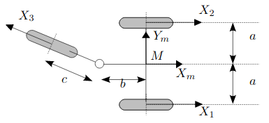
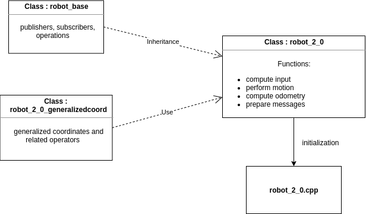
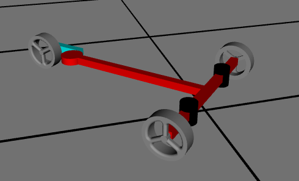

#  Projet1

June 08, 2020

Editors:

* Bianca Lento
* Andrea Gotelli

This file aim to explain how to move inside this project. It should be read before starting to look around, it can give some insight on the elements and structure of the code.

## Index

* [Introduction](#S-Introduction)
* [Launch File](#-Launch)
* [Robot(2,0)](#S-Robot(2,0))
* [Interfaces](#S-Interfaces)
* [Sensor](#S-Sensor)
* [World](#S-World)
* [Utility](#S-Utility)
* [File handler](#S-FileHandler)
* [URDF](#S-URDF)
* [Compute Twist](#S-Compute)
* [How to Use](#S-HowTo)
* [Catkin Build](#S-Build)
* [PyQtGraph](#S-PyQtGraph)

# Introduction

  The package is structured in a semantic way. In other words, each file is designed to contain everything
that is related to a certain topic or concept. The following chapters will guide the user into everything
there is to know before using them.

* [The structure of this project](#Ri-structure)
* [The simulation meta package](#Ri-simulation)
* [The estimator meta package](#Ri-estimator)
* [The plotting package](#Ri-plotting)

## The structure of this project
  The project is divided into two main sections: the simulation and the estimator. For each of the two packages
an interface is provided, and the user should only use this last one to change the parameters. On virtually,
there is no need to change anything in the code to use this application. As a result, anyone with a basic
knowledge of YAML file can use this package. (see [Launch File](#S-Launch) ).

  The project has four packages: the simulation meta package and the estimator, data and plotting packages.
The data package exists to be used as storage unit for the file that are generated. In this way, there is no
risk of having to find files around the project.The plotting package is to take the desired file form the
data package, which contains the processed data, and plot the results.

  The simulation package is the first to be discussed, with all its components.
## The simulation meta package

  When opening the simulation meta package, the reader can see three packages: simulation, simulation_messages
and simulation_descriptions. Their description is provided below.

### The simulation_messages package
  This package contains the messages defined for this application. In fact, in this case the definition of
the messages comes in handy for the IR sensors and encoders readings. They help in having a more semantic
interface among the nodes and the reflects their implementation.

  For example, the message for the encoders reading contains simply two doubles, but their names are
phi_1f, and phi_2f. As a result, in the context of the encoders, it is immediate to understand to which
wheel the two values refer.

  For what concerns the message for the IR sensors, it contains just a pair of booleans, directly referring
to the relative sensor state. Here, again, it is immediate to understand the related sensor to each boolean.

  The reason behind of this decoupling is for preventing some nasty and non trivial to solve errors. In fact,
defining the messages directly in the package where they are implemented it is not a safe approach. If they
were defined there, once building the package in a new device (or after having deleted the devel, log and build
folder of the catkin workspace), the build may fail. The reason is that there is no way to guarantee to
build the messages first (so the include files will be generated) before building any executable which uses
them, resulting in an uncomfortable compile time error. However this guarantee is valid only when using catkin
build command. (see [Catkin Build](#S-Build) )

### The simulation_descriptions package
  This package is meant to contain only the description of the robot. (see [URDF](#S-URDF) ).

### The simulation package
  This package is the most important of the three. It contains all the functions and interfaces implemented
in this project. Each executable of this package is designed in an source file + one or more header files.

  In the reading of the code, the reader may find some "strange" declarations or it may ask to himself why
a certain choice has been made. For developing this project, we solved every doubt using the suggestions
provided in the [C++ Core Guidelines](http://isocpp.github.io/CppCoreGuidelines/CppCoreGuidelines).

  The package contains the core of the simulation, and the tools for build an user friendly interface.
The core of the simulation is composed by the (2, 0) robot and its sensors. The following UML describes the
high level architecture  

  

For understand the components in detail see: [Robot(2,0)](#S-Robot(2,0)), [Sensor](#S-Sensor) and [Interfaces](#S-Interfaces).

  The following UML shows the architecture for the intended interface.

  The components of this last UML are discussed in this document, see [Interfaces](#S-Interfaces).

## The estimator meta package

This meta package contains all the needed tools to implement an Kalman Filter based estimator. It contains
two packages: the estimator and the estimator_messages package.

### The estimator_messages package

This package contains all the messages that are needed in order to simply publish messages containing
information about the estimation, such as the measurements, for example. Here again, the reason for
divide the package are the same as before. (see [simulation_messages package](#S-simulation) )

### The estimator package

WORK IN PROGRESS

## The plotting package

This last package contains a python script and a related interface as launch file.
The script simply loops into the rosbag corresponding to the desired file to be loaded.
Then it plots the result in some PyQtGraph windows. (see [PyQtGraph](#S-PyQtGraph) )

# Launch File
  As previously stated, the launch file is the intended interface for this application. The reason is that,
to change the simulation output and try different configurations the user should not be forced to change the code and
build it. This is an error-prone approach and a user may not have sufficient skill for doing this procedure properly.
On the other hand, having a launch file as interface, allows change safely the simulation parameters.

  The parameters that can be changes are the following:

  * The robot initial posture
  * The robot geometrical parameters
  * The wheels radius and max speed
  * The encoders resolution
  * The sensors positions
  * The tiles dimensions
  * The line thickness between the tiles
  * The folder where to save the file
  * The name of the file
  * Setting the available hardware

  All the parameters are discussed and explained in the appropriate launch file, named interface.launch.
If there are any constraints or suggestions for the parameters, these are also discussed. The second launch
file, contains all the node and groups definitions. This last launch file should not be modified for any reason.

# Robot(2,0)

The simulation implements the model of a (2, 0) robot as the one below. The figure contains all the parameters that
have been used in the code and the URDF.

  The robot component is constituted by two header files: robot_2_0.h, robot_base.h and it also makes use of an third
one: robot_2_0_generalizedcoord.h. They are initialized with the parameters obtained in the executable: robot_2_0.cpp.
As the simulation is divided in two parts, the robot kinematic and the interface with ROS environment, the idea is to
separate these parts also in the package. In this way, the user needs only to pick the correct file accordingly to what
of interest.

* [The robot_base.h](#Ri-Robot(2,0))
* [The robot_2_0_generalizedcoord.h](#Ri-Robot(2,0))
* [The robot_2_0.h](#Ri-Robot(2,0))

### The robot_base.h
  It contains all the ROS related functions, i.e. publisher, subscribers and operations. This class is mostly an interface,
it provides the tools to interface the ROS architecture. To enforce this idea, it contains only pure virtual function,
the only exceptions are the callback for the Twist message and the function isMoving() that are virtual. Is the member function
isMoving() that calls all the other memeber functions. In this way,all the functions are executed in order to make the
simulation possible and accurate.

##### See below

        virtual void isMoving();

      protected:

        //  Virtual Callback
        inline virtual void TwistReceived(const geometry_msgs::Twist::ConstPtr& twist);

        //  Function to convert the received twist from the controller into the
        //  input defined for the robot which is implemented
        virtual void ComputeInput() const=0;

        //  This function contains all the computations related to the robot kinematic
        virtual void PerformMotion() const=0;

        //  This function computed the encoders reading and create a posture from the
        //  computed data, to make it possible to check the computations consistency.
        virtual void ComputeOdometry() const=0;

        //  This function is meant to prepare the messages to be published. In other
        //  words, in this function the data obtained in the cycle are copied into
        //  the messages just before they are published.
        virtual void PrepareMessages()=0;

  Defining the member functions in this proposed way allows the following:

  * The functions declared as pure virtual must have an override in every class that inherits from this
    base class. In fact, they define the robot kinematic and characteristics, so every robot must define
    their bodies accordingly with its model.
  * Having them declared in the base class allows creating a sequence in the function isMoving(). The
    function is declared as virtual, so if an user think to change the calling order of the other member
    function, it is just necessary to declare the customized override. However, there are no many reasons to
    change the proposed order.

### The robot_2_0_generalizedcoord.h
  The robot_2_0_generalizedcoord contains the definition of the generalized coordinates structure. It is
used for all the kinematic computations and the related operators. Using the object GeneralizedCoordinates
allows having a semantic and user friendly computation for the kinematic model.

##### Example

        void Robot_2_0::PerformMotion() const
        {

          q_dot = S*u;

          q = q + (*q_dot.Integrate(timeElapsed)) ;

        }

  The computation is very close to what is provided in the MOBRO course. In fact, the computation of the derivative of
the robot configuration vector follows the same notations. Then, to compute the current values of the configuration
vector the derivative is evaluated using the notion of the time elapsed in between two iterations.

  For the use of (*...) this is because the returned element of the Integrate memeber function is a smart pointer.
This last decision is dicussed in the file robot_2_0_generalizedcoord.h, the reader is encouraged to read it from there.

### The robot_2_0.h
  The robot_2_0 contains the declaration of all the functions related to simulating the robot motion. Firstly,
the input is computed from the Twist message and the max speed of the wheels in ensured to both. Accordingly to the
obtained input, the matrix that represents the kinematic model ( S(q) ) is updated and used to get the derivative of
the generalized coordinates of the robot. This computation allows to:
  * Obtain the changes in the configuration vector from the last iteration
  * Apply the changes to the current configuration vector

  Moreover, in this file it is computed the odometry. The procedure is well explained in the related file. The
reader is encouraged to read it from there.

# Interfaces
  The interface is meant to implement already existing facilities. Specifically, for the scope of the simulation, Rviz
is used as graphic and user friendly interface. The user who runs the simulation can see the robot motion and sensors
behaviors on the fly. Moreover, the path that has been generated remains visible, allowing the customization of closed
loop trajectories.

  The output of the simulation are a .bag and a .yaml files. The first one contains all the messages that have been
published, the second one the parameters that has been used. In this way, it is possible to use the generated data.
The saving procedure is defined for ensuring a safe saving procedure for the generated files. ( see [File Handler](#S-FileHandler)).

  For the inputs, the package provides two solutions: the possibility to use a jostick or the keyboard. The hardware
can be selected in the appropriate launch file (see [Launch File](#S-Launch)). In the following, an UML showing the
architecture for the joystick interface is provided.

  The following explains the steps to follow in order to implement a joystick to control the robot. First, connect the
joystick to the computer and then check if it recognised by the computer.

##### The command to run is:
        ls /dev/input/

##### The output should be something like:
        event0   event11  event14  event17  event2   event5  event8  js1     mouse1

  In this case, the joystick is recognised as js1

  Now, check if the jstest package is installed, just typing it on the command line. In the case it is not installed, is
just necessary to run these two lines:  

        sudo apt-get update -y

        sudo apt-get install -y jstest-gtk

  With the correct package is possible to test the joystick status:

        sudo jstest /dev/input/js1

  The last command is necessary to make sure to have the controller working on Ubuntu. The buttons and axes status
should change if the controller is used. The ROS package which handle the joystick has to be instaled:

        sudo apt-get install ros-<distro>-joy

  Writing the implemented ROS distribution instead of <distro>. Then, at this point, the permission to the joystick.
##### Running the command:

        ls -l /dev/input/js1

  The output should be something like:

        crw-rw-rw-+ 1 root input 13, 1 mai   16 19:55 /dev/input/js1

  Here is important to notice the characters after crw-rw- it should be written rw; if not (it may be crw-rw-r--+ )
then run the command:

        sudo chmod a+rw /dev/input/js1

  Then check again with the previus command. At this point is possible to run the ROS node and check the output.
  First set the parameter:

        rosparam set joy_node/dev "/dev/input/js1"

  And then run the node:

        rosrun joy joy_node

  To check the output, a simple rostopic is sufficient:

        rostopic echo joy

  Now each time a button of a lever is pressed, moved or released; in the terminal a message should appear.
To implement the joystick in the package, the adapter component must be defined. An existing one is already
in the package. (see [Compute Twist](#S-Compute)).

  Concerning the key_node, there no need of any package or installation. However, the control of the robot
is less accurate then when using a joystick.

# Sensor
  The sensors that are mounted in the robot are simulated with the use of the functions declared in the relative files.
There are two files which allow to simulate the sensor behavior: the sensor.cpp and sensor.h which are discussed below.

### sensor.cpp
  The sensor.cpp source file collects all the parameters of the robot sensors and the world; it crates an instance of it
to store in every sensor class. (see [World](#S-World) ).

  There are a few others basic operations done in this file. It subscribes to the robot position and it publishes the
current sensors state. Additionally, it publishes some markers to allow the representation of the measurements. In the main loop, the sensor status are checked periodically, using the method describes in the
header file.

### sensor.h
  The header file for the sensors contains the definition of the class Sensor and RobotSensors. This last one is useful,
as it provides a tool to ensure that, for any reason, the sensors have two different instances of the world. The Sensor
class, provides all the functions needed to check the sensor status and obtain it absolute positions. Moreover, it
provides some tools needed in the estimation. As the procedure is carefully explained in the code, the reader is
encouraged in reading it from there.

The reason to embed functions for the two sections (simulation and estimation ) comes out of a practical point of view.
In fact, the sensor behavior is quite the same; instead of defining two similar classes, it is less error prone to
use the same classes with some sightly different functions.

# World

  The aim of this header file is to separate the definition of the world from the other parts of the simulation. In fact,
as it is used in different files, it is more convenient to have it declared in a specific header file to include where needed.
The world is characterized by the distance between horizontal lines (xSpacing), the distance between vertical lines
(ySpacing) and the line thickness.

##### Members
      private:

       const double xSpacing { 1.0 };
       const double ySpacing { 1.0 };
       const double lineThickness { 0.005 };

# Utility

  This file contains all the functions needed by other files that are not strictly related to them. It contains
all the functions related to the markers: in particular, the ones to initialize and update them and also the ones
used by the sensors to show when they become active. In fact, as a sensor crosses a line, its state changes and it
places a marker, red o green based on which sensor, to highlight this commutation of state.

##### See the code index

        //  Forward declarations
        struct Quaternion;

        template<class QuaternionTemplated>
        struct item_return;

        struct EulerAngles;

        struct Pose2D;

        enum SENSOR { RIGHT, LEFT };

        enum COLOR { RED, GREEN };

        //  Constrain an angle in the range [-M_PI, M_PI]
        inline const double LimitAngle( double a) ;

        //  Converting specified Eulers angles to a Quaterion (generic)
        template<class QuaternionTemplated>
        typename item_return<QuaternionTemplated>::type ToQuaternion(const double yaw, const double pitch=0.0, const double roll=0.0);

        //  Converting a quatersion to Euler Angles
        template<class QuaternionTemplated>
        EulerAngles ToEulerAngles(const QuaternionTemplated& q);

        //  Initialize a marker for the line strip (robot generated path)
        void InitLineStrip(visualization_msgs::Marker& generatedPath);

        //  Used to upate the path generated by the robot in the simulation
        void UpdatePath(const geometry_msgs::PoseStamped& robotPosture,
                                  visualization_msgs::Marker& generatedPath );

        //  Function that returns a marker for the active sensor
        visualization_msgs::Marker PlaceActiveSensor(const Pose2D& point, const SENSOR& activeSensor);

        //  Function creating a marker accordingly with the active sensor
        visualization_msgs::Marker PlaceMarker(const Pose2D& point, const COLOR& markerColor, const std::string side, const int index);

  It also contains everything is needed to convert from quaternion to Euler angles and vice versa. In others words, the
aim of this file is to group all the elements that do not belong to any "concept" but that are still important for the
simulation.

# File Handler

  The aim of this file is to save all the recorded data in the proper folder. Moreover, as the architecture is versatile
and some parameters can be changed (see [Launch File](#S-Launch)), all the characteristic of the robot, of the sensors and
of the world are also saved,so in this way, all the details are always visible and available.

 This node has also a build in method to ensure the existence of the folder where to storage the files. It also has other
properties that are well explained in the begin of the file; the reader is encouraged to read them from there.

# URDF

  The robot model is build with an URDF, in particular it is implemented using xacro. The model built is the standard
configuration of the robot type (2, 0) with two fixed wheels and a castor one. As xacro is used, every characteristic
of the robot changes accordingly to the user definition (see [Launch File](#S-Launch)). In this way, the model
remain always coherent with the computations and data produced.
However, some of this characteristic, that can not be changed by the user, are expressed as function of other parameters.

# Compute Twist

  This executable is an adapter component that takes the status of the controller, in this case the joystick, and
outputs a feasible twist for the robot. Depending on the type of joystick the implementation could change as it is
explained in the interface section (see [Interface](#S-Interface)). If another joystick has to be implemented,
this component must be changed accordingly. The file is self explanatory and the code can be simply
modified to implement the different joystick.

# How to Use

  The simulation is created as a catkin workspace, so if the user does not know how to create one please consult the tutorials
on the following link:
http://wiki.ros.org/catkin/Tutorials

  After downloading the zip file, the user can extract just what is inside the "Project1", the two folders "data" and "simulation_pkg",
and copy them in the src folder of your catkin workspace. Alternatively, the user can download the folder where it is more
convenient and create a link in the catkin workspace.

##### Once in the catkin_ws/src run:
        sudo ln -s /<the path to the folder>/Project1

Then the user has to compile the packages running the command (see [Catkin Build](#S-Build) ):

        catkin build

As the workspace packages changed, the user has to execute the command:

      source devel/setup.bash

Note also that if the user is running from a different location, he has to specify it in the command, as for example:

      source home/project/devel/setup.bash

Remember that if this execution has to be done every time the package is modified.

# Catkin Build
It is suggested to use caktin build instead of the common catkin_make. The reason is that, as in the project
there are some messages that are created in the simulation_messages package, only catkin build ensures that
the packages defining messages are build first, and then the others. With catkin_make it it not possible to
ensure that a package is build only after the one containing messages i.e. that the include files are been
generated. This last issue will cause some annoying compile errors.
To use this command it is necessary to install the catkin_tool_box. A procedure is provided below:

##### Run the following commands
        sudo sh -c 'echo "deb http://packages.ros.org/ros/ubuntu `lsb_release -sc` main" > /etc/apt/sources.list.d/ros-latest.list'
        wget http://packages.ros.org/ros.key -O - | sudo apt-key add -
        sudo apt-get update
        sudo apt-get install python-catkin-tools

Now it could be possible to run the following commands:

        cd ~/WorkSpaces/catkin_ws/        (this depends on the root configurations)
        catkin build

However some users may gave the following problem if they already have used catkin_make:

        The build space at '/home/user/catkin_ws/build' was previously built by 'catkin_make'. Please remove the build space or pick a different build space.

No big deal, just delete everything in the workspace (except for the src) and the run the commands:

        cd ~/WorkSpaces/catkin_ws/
        catkin build

# Catkin PyQtGraph

PyQtGraph is an easy and intuitive interface. It is also said to be more interactive and fluid compared
to MatPlot, it also works with python3. The package has to be installed because it is not build-in in Ubuntu.

To help the user in the installation, a tested procedure is reported below:

The first step is the suggestion to create a folder in the home named "program_sources" (or another desired name).
Once inside the created folder the package has to be downloaded
        git clone https://github.com/pyqtgraph/pyqtgraph.git

The package is now downloaded in the computer and needs a setup.
##### First, run the following:
        python3 -m pyqtgraph.examples

A window should open, in contains a list of examples on the left and the related code on the right.
The examples provide all the needed insight to create custom plots and multiple windows.
However, if it doesn't work, that's because the package is in your computer but not installed.
##### The problem should result in the following error:

        user@user:~$ python3 -m pyqtgraph.examples
        /usr/bin/python3: Error while finding module specification for 'pyqtgraph.examples' (ModuleNotFoundError: No module named 'pyqtgraph')

##### The solution is to simply run a pip installation
        sudo pip install pyqtgraph

To test the package now run the command:

        python3 -m pyqtgraph.examples

If it doesn't work, that's because PyQt5 is missing. It is thus needed to install it.
##### Run the following
        sudo pip install pyqt5

At this point there are not any missing dependencies, and the package will open.
