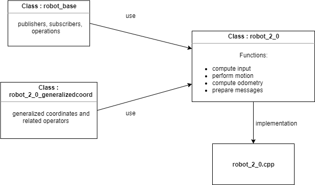
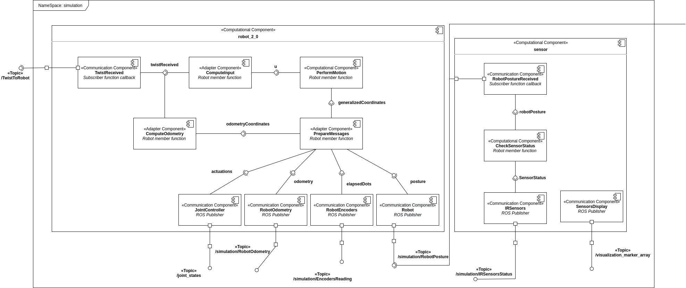
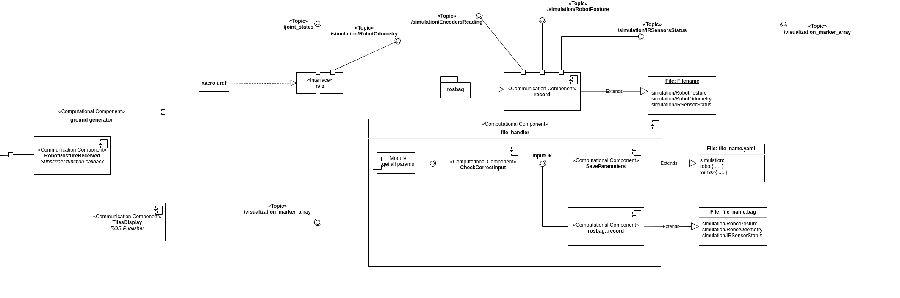

initialization#  Projet1

June 08, 2020

Editors:

* Bianca Lento
* Andrea Gotelli

This file aim to explain how to move inside this project. It should be read before starting to look around, it can give some insight on the elements and structure of the code.

## Index

* [Introduction](#S-Introduction)
* [Launch File](#-Launch)
* [Robot(2,0)](#S-Robot(2,0))
* [Interfaces](#S-Interfaces)
* [Sensor](#S-Sensor)
* [World](#S-World)
* [Utility](#S-Utility)
* [File handler](#S-FileHandler)
* [URDF](#S-URDF)

# Introduction

  The package is structured in a semantic way. In other words, each file is designed to contain everything
that is related to a certain topic or concept. The following chapters will guide the user into everything
there is to know before using them.

* [The structure of this project](#Ri-structure)
* [The simulation meta package](#Ri-simulation)
* [The estimator package](#Ri-estimator)

## The structure of this project
  The project is divided into two main part: the simulation and the estimator. For each of the two packages
an interface is provided, and the user should only use this last one to change the parameters. On virtually,
there is no need to change anything in the code to use this application. As a result, anyone with a basic
knowledge of YAML file can use this package. (see [Launch File](#S-Launch) ).

  The project can be dived into three main parts: the simulation meta package, the estimator and data packages.
This last packages exists to be used as storage unit for the file that are generated. In this way, there is no
risk of having to find files around the project.

  The simulation package is the first to be discussed, with all its components. After the estimator will be
presented.

## The simulation meta package
  When opening the simulation meta package, the reader can see three packages: simulation, simulation_messages
and simulation_descriptions. Their description is provided below.

### The simulation_messages package
  This package contains the messages defined for this application. In fact, in this case the definition of
the messages comes in handy for the IR sensors and encoders reading. The helps in having a more semantic
interface among the nodes and the reflects their implementation.

  For example, the message for the encoders reading contains simply two doubles, but their names are
phi_1f, and phi_2f. As a result, in the context of the encoders, it is immediate to understand to which
wheel the two values refer.

  For what concerns the message for the IR sensors, it contains just a pair of booleans, directly referring
to the relative sensor state. Here, again, it is immediate to understand the related sensor to each boolean.

  The reason behind of this decouple is for preventing some nasty and non trivial to solve errors. In fact,
defining the messages directly in the package where they are implemented it is not a safe approach. If they
were defined there, once building the package in a new device (or after having deleted the devel, log and build
folder of the catkin workspace), the build will fail. The reason is that there is no way to guarantee to
build the messages first (so the include files will be generated) before building any executable which uses
them, resulting in an uncomfortable compile time error.

### The simulation_descriptions package
  This package is meant to contain only the description of the robot. (see [URDF](#S-URDF) ).

### The simulation package
  This package is the most important of the three. It contains all the functions and interfaces implemented
in this project. Each executable of this package is designed in an source file + one or more header files.

  In the reading of the code, the reader may find some "strange" declarations or it may ask to himself why
a certain choose has been made. For developing this project, we solved every doubt using the suggestions
provided in the [C++ Core Guidelines](http://isocpp.github.io/CppCoreGuidelines/CppCoreGuidelines).

## In.estim: The estimator package

# Launch File
  As previously stated, the launch file is the intended interface for this application. The reason is that,
to change the simulation output and try different configurations the user should be forced to change the code and
build it. This is an error-prone approach and a user may not have sufficient skill for doing this procedure properly.
On the other hand, having a launch file as interface, allows change safely the simulation parameters.

  The parameters that can be changes are the following:

  * The robot initial posture
  * The robot geometrical parameters
  * The wheels radius and max speed
  * The encoders resolution
  * The sensors positions
  * The tiles dimensions
  * The line thickness between the tiles
  * The folder where to save the file
  * The name of the file
  * Setting the available hardware

  All the parameters are discussed and explained in the appropriate launch file, named interface.launch.
If there are any constraints or suggestions for the parameters, these are also discussed. The second launch
file, contains all the node and groups definitions. This last launch file should not be modified for any reason.

# Sensor
  The sensors that are mounted in the robot are simulated with the use of the functions declared in the relative files.
There are two files which allow to simulate the sensor behavior: the sensor.cpp and sensor.h which are discussed below.

### sensor.cpp
  The sensor.cpp source file collects all the parameters of the robot sensors and the world; it crates an instance of it
to store in every sensor class. (see [World](#S-World) ).

  There are a few others basic operations done in this file. It subscribes to the robot position and it publishes the
current sensors state. Additionally, it publishes some markers to allow the representation of the measurements. In the main loop, the sensor status are checked periodically, using the method describes in the
header file.

### sensor.h
  The header file for the sensors contains the definition of the class Sensor and RobotSensors. This last one is useful,
as it provides a tool to ensure that, for any reason, the sensors have two different instances of the world. The Sensor
class, provides all the functions needed to check the sensor status and obtain it absolute positions. As the procedure is
carefully explained in the code, the reader is encouraged in reading it from there.

# Robot(2,0)

  The robot component is constituted by two header files: robot_2_0.h, robot_base.h and it also makes use of an third
one: robot_2_0_generalizedcoord.h. They are initialized with the parameters obtained in the executable: robot_2_0.cpp.
As the simulation is divided in two parts, the robot kinematic and the interface with ROS environment, the idea is to
separate these parts also in the package. In this way, the user needs only to pick the correct file accordingly to what
of interest.

* [The robot_base.h](#Ri-Robot(2,0))
* [The robot_2_0_generalizedcoord.h](#Ri-Robot(2,0))
* [The robot_2_0.h](#Ri-Robot(2,0))

### The robot_base.h
  It contains all the ROS related functions, i.e. publisher, subscribers, operations. In this class,
all the functions are declared as virtual and called in the isMoving() member function, that executes all of them
in order to make the simulation possible and accurate. This class is mostly an interface, it provides the tools to interface
the ROS architecture. To enforce this idea, it contains only pure virtual function, the only exceptions are the callback for
the Twist message and the function IsMoving() that are virtual.

##### See below

        //  Virtual Callback
        inline virtual void TwistReceived(const geometry_msgs::Twist::ConstPtr& twist);

        //  Function to convert the received twist from the controller into the
        //  input defined for the robot which is implemented
        virtual void ComputeInput() const=0;

        //  This function contains all the computations related to the robot kinematic
        virtual void PerformMotion() const=0;

        //  This function computed the encoders reading and create a posture from the
        //  computed data, to make it possible to check the computations consistency.
        virtual void ComputeOdometry() const=0;

        //  This function is meant to prepare the messages to be published. In other
        //  words, in this function the data obtained in the cycle are copied into
        //  the messages just before they are published.
        virtual void PrepareMessages()=0;

### The robot_2_0_generalizedcoord.h
  The robot_2_0_generalizedcoord contains the definition of the generalized coordinates structure, a powerful structure
used for all the computations related to the kinematic, and the related operators.

### The robot_2_0.h
  The robot_2_0 contains the declaration of all the function related to the simulation of the robot motion. Firstly,
the input is computed from the Twist message and the max speed of the wheels in ensured to both. According to the
obtained input, the matrix that represents the kinematic model ( S(q) ) is updated and used to get the derivative of
the generalized coordinates of the robot. This computation allows to, after a integration over the time elapsed from
the last one, update the generalized coordinates adding what obtained with the current value.

  Moreover, in this file it is computed the odometry. Starting from the current value of phi angles of the two fixed
wheels, the elementary rotation of the two wheels between two instants of time are computed taking into account the
wheel resolution. In this way, the discretized input is obtained and, through it, the odometry coordinates are updated.

# Interfaces
  The interface is meant to implement already existing facilities. Specifically, for the scope of the simulation, Rviz
is used as graphic and user friendly interface. The user who runs the simulation can see the robot motion and sensors
behaviors on the fly. Moreover, the path that has been generated remains visible, allowing the customization of closed
loop trajectories.

  The output of the simulation are a .bag and a .yaml files. The first one contains all the messages that have been
published, the second one the parameters that has been used. In this way, it is possible to use the generated data.

# World

  The aim of this header file is to separate the definition of the world from the other parts of the simulation as it
is used in different files and is more useful to have it declared in a specific header file to include where needed.
The world is characterized by the distance between horizontal lines (xSpacing), the distance between vertical lines
(ySpacing) and the line thickness.

  In order to show the world in rviz and so in the simulation, the ground generator is implemented with its header
file. It generates a tiled floor, using chunk, represented by a white parallelepiped of size 5x5 meters. Some lines
are generated in order to highlight the separating lines of each tile.

# Utility

  This file contains all the functions needed by other files that are not strictly related to them. It contains
all the functions related to the markers: in particular, the ones to initialize and update them and also the ones
used by the sensors to show when they become active. In fact, as a sensor crosses a line, its state changes and it
places a marker, red o green based on which sensor, to highlight this commutation of state.

  Moreover, it contains everything is needed to convert from quaternion to Euler angles and vice versa. In fact, the
aim of this file is to group all the elements that do not belong to any "concept" but that are still important for the
simulation in one class.

# FileHandler

# URDF

  The robot model is build with an URDF, in particular it is implemented using xacro. It can be found as urdf per se
or as xacro file in the simulation_descriptions folder. The model built is the standard configuration of the robot
type (2, 0) with two fixed wheels and a castor one. As xacro is used, every characteristic of the robot is passed
as a parameter, it can be changed by the user in the proper launch file and it can be seen in the simulation itself.
Some of this characteristic, that can not be changed by the user, are expressed as function of other parameters.

