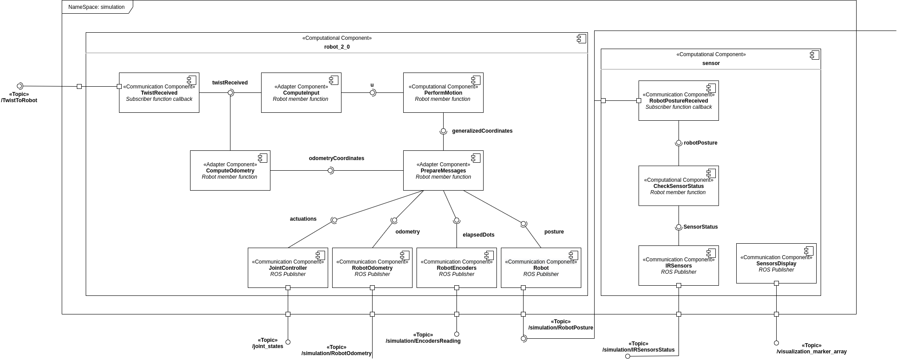

#  Projet1

June 08, 2020

Editors:

* Bianca Lento
* Andrea Gotelli

This file aim to explain how to move inside this project. It should be read before starting to look around, it can give some insight on the elements and structure of the code.

## In.sec: Major sections

* [In: Introduction](#S-Introduction)
* [Robot(2,0)](#S-Robot(2,0))
* [Interfaces](#S-Interfaces)
* [Sensor](#S-Sensor)
* [World](#S-World)
* [Utility](#S-Utility)
* [File handler](#S-FileHandler)

# Introduction

  The package is structured in a semantic way. In other words, each file is designed to contain everything
that is related to a certain topic or concept. The following chapters will guide the user into everything
there is to know before using them.

* [In.struct: The structure of this project](#Ri-structure)
* [In.sim: The simulation meta package](#Ri-simulation)
* [In.estim: The estimator package](#Ri-estimator)

## In.struct: The structure of this project
  The project is divided into two main part: the simulation and the estimator. For each of the two packages
an interface is provided, and the user should only use this last one to change the parameters. On virtually,
there is no need to change anything in the code to use this application. As a result, anyone with a basic
knowledge of YAML file can use this package.

  The project can be dived into three main parts: the simulation meta package, the estimator and data packages.
This last packages exists to be used as storage unit for the file that are generated. In this way, there is no
risk of having to find files around the project.

  The simulation package is the first to be discussed, with all its components. After the estimator will be
presented.

## In.sim: The simulation meta package
  When opening the simulation meta package, the reader can see three packages: simulation, simulation_messages
and simulation_descriptions. Their description is provided below.

### The simulation package 

## In.estim: The estimator package

# Robot(2,0)

  The robot component is constituted by three header files, robot_2_0, robot_base and robot_2_0_generalizedcoord,
and an executable. As the simulation is divided is two parts, the robot kinematic and the interface with ROS
environment, the idea is to separate these parts also in the package.

  The robot_base contains all the ROS related functions, i.e. publisher, subscribers, operations. In this class,
all the functions are declared as virtual and called in the isMoving() member function, that executes all of them
in order to make the simulation possible and accurate. This class is mostly an interface and so, for definition, it
should contain only virtual member function and no member elements.

  The robot_2_0_generalizedcoord contains the definition of the generalized coordinates structure, a powerful structure
used for all the computations related to the kinematic, and the related operators.

  The robot_2_0 contains the declaration of all the function related to the simulation of the robot motion. Firstly,
the input is computed from the Twist message and the max speed of the wheels in ensured to both. according to the

