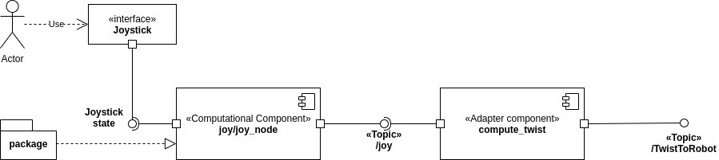

#  Projet1

June 08, 2020

Editors:

* Bianca Lento
* Andrea Gotelli

This file aim to explain how to move inside this project. It should be read before starting to look around, it can give some insight on the elements and structure of the code.

## In.sec: Major sections

* [Introduction](#S-Introduction)
* [Robot(2,0)](#S-Robot(2,0))
* [Interfaces](#S-Interfaces)
* [Sensor](#S-Sensor)
* [World](#S-World)
* [Utility](#S-Utility)
* [File handler](#S-FileHandler)

# Introduction

# Robot(2,0)

